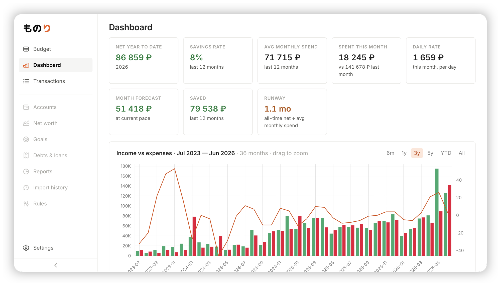

# monori

monori is a self-hosted, single-user **envelope budgeting** app — the YNAB-style workflow of a spreadsheet budget, rebuilt as a fast web app. It keeps the exact math of the Google Sheets budget it grew from, and adds inline editing, bank-statement import with auto-categorization, a full-year budget grid, and a dashboard with analytics. All money is stored as integer kopecks/cents end to end, so there is no floating-point rounding anywhere.

## License

[MIT](LICENSE) © alchemmist
