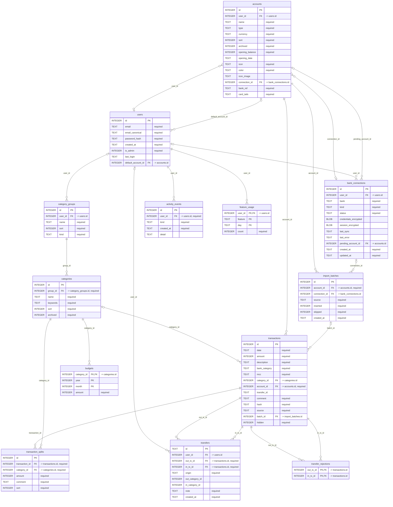

# Data model

Everything monori knows lives in one SQLite file (`MONORI_DB`, default
`server/data/monori.db`). The schema is created on first connection and runs in
WAL mode with foreign keys enabled. A handful of tables hold the whole budget —
the diagram below is generated from the schema itself.

The schema has a single canonical definition in `server/schema.sql`; its
history lives as [Alembic](https://alembic.sqlalchemy.org/) revisions in
`server/migrations/versions/`. A fresh database is created straight from
`schema.sql` and stamped at the latest revision; an existing database is
upgraded through the migration chain on first connection. Databases created
before the Alembic switch (which tracked migrations with SQLite's
`PRAGMA user_version`) are adopted automatically: they are stamped at the
matching revision and upgraded from there (see the accounts migration below).

## Schema diagram

The diagram below is generated from `server/schema.sql` — it is the real shape
of the database, read back through `PRAGMA` after executing the schema, not a
drawing kept in sync by hand. Regenerate it with `make schema-diagram`; CI fails
if the schema changed and the diagram did not.

<!-- schema-diagram:start -->

<!-- generated from server/schema.sql by scripts/gen_schema_diagram.py — run `make schema-diagram` after changing the schema -->

<!-- schema-diagram:end -->

## Money

Every amount — transactions, budgets — is a **signed integer in kopecks/cents**.
A ruble value like `1 500,00` is stored as `150000`. Expenses are negative,
income positive. There is no floating-point money anywhere; rubles exist only at
the display edge. This is what lets budget totals reconcile exactly with the
ledger.

## Tables

### `category_groups`

Top-level buckets that give categories their income/expense meaning.

| Column | Type | Notes |
| -------- | ------ | ------- |
| `id` | INTEGER PK | |
| `user_id` | INTEGER | → `users(id)`; owner. `NULL` only for unclaimed pre-multi-user rows |
| `name` | TEXT | unique per user |
| `sort` | INTEGER | display order |
| `kind` | TEXT | `income` or `expense` (checked) |

### `accounts`

Where money physically sits: bank cards, cash, savings. Every transaction
belongs to exactly one account.

| Column | Type | Notes |
| -------- | ------ | ------- |
| `id` | INTEGER PK | |
| `user_id` | INTEGER | → `users(id)`; owner. `NULL` only for unclaimed pre-multi-user rows |
| `name` | TEXT | unique per user |
| `type` | TEXT | `card` / `cash` / `savings` / `other`; default `other` |
| `icon` | TEXT | display glyph name (e.g. `wallet`, `card`, `ruble`); default `wallet` |
| `color` | TEXT | `#rrggbb` tint for the glyph and its tile; default `#5b6472` |
| `icon_image` | TEXT | optional custom icon as an image data URL; when set it overrides `icon`/`color` |
| `currency` | TEXT | ISO code, default `RUB`. A label only — monori is single-currency for now (see issue #29) |
| `sort` | INTEGER | display order; default `0` |
| `archived` | INTEGER | `0`/`1`; default `0` |
| `opening_balance` | INTEGER | kopecks; default `0` |
| `connection_id` | INTEGER | → `bank_connections(id)`; the bank login this account syncs through, nullable |
| `bank_ref` | TEXT | bank-side account locator within that login; default `''` |
| `opening_date` | TEXT | ISO date, nullable |

An account's **running balance** is `opening_balance` plus the sum of its
transactions. Reconcile compares this to your real bank balance and posts an
adjustment for any difference.

### `categories`

The envelopes.

| Column | Type | Notes |
| -------- | ------ | ------- |
| `id` | INTEGER PK | |
| `group_id` | INTEGER | → `category_groups(id)` |
| `name` | TEXT | unique per user (enforced in the API) |
| `keywords` | TEXT | pipe-separated, for import auto-categorization; default `''` |
| `sort` | INTEGER | display order; default `0` |
| `archived` | INTEGER | `0`/`1`; default `0` |

### `transactions`

The ledger.

| Column | Type | Notes |
| -------- | ------ | ------- |
| `id` | INTEGER PK | |
| `date` | TEXT | ISO-8601 datetime |
| `amount` | INTEGER | signed kopecks; negative = expense |
| `description` | TEXT | default `''` |
| `bank_category` | TEXT | the bank's own label; default `''` |
| `mcc` | TEXT | merchant category code; default `''` |
| `category_id` | INTEGER | → `categories(id)`, `ON DELETE SET NULL` |
| `account_id` | INTEGER | → `accounts(id)`, NOT NULL |
| `transfer_id` | TEXT | links the two legs of a transfer; `NULL` for normal rows |
| `comment` | TEXT | default `''` |
| `hash` | TEXT | `sha1(date \| amount \| description)`, for dedup |
| `source` | TEXT | `import` / `manual` / `transfer` / `adjustment` / `sync` / `sheets`; default `import` |
| `batch_id` | INTEGER | → `import_batches(id)`, `ON DELETE SET NULL`; the batch that inserted the row (paste or sync), nullable |

Indexes: `date`, `hash`, `category_id`, `account_id`.

A **transfer** between your own accounts is two linked rows sharing a
`transfer_id`: a negative leg on the source account and a positive leg on the
destination. Both are uncategorized, so a transfer never counts as income or
expense in analytics — this is enforced by construction, not by convention.

### `budgets`

One assigned amount per category per month.

| Column | Type | Notes |
| -------- | ------ | ------- |
| `category_id` | INTEGER | → `categories(id)`, `ON DELETE CASCADE` |
| `year` | INTEGER | |
| `month` | INTEGER | 1–12 (checked) |
| `amount` | INTEGER | kopecks |

Primary key is `(category_id, year, month)`, so there is at most one cell per
category-month. A cell with amount `0` is deleted rather than stored.

### `bank_connections`

One bank login owned by a user. Any number of accounts link to a connection via
`accounts.connection_id`, each carrying its own bank-side locator in
`accounts.bank_ref` (for T-Bank: the id from the cabinet's
`/mybank/operations/?account=<id>` link). A sync logs in once per connection and
pulls every linked account in turn. Secrets are stored encrypted with
`MONORI_ENCRYPTION_KEY` and are never serialized.

| Column | Type | Notes |
| -------- | ------ | ------- |
| `id` | INTEGER PK | |
| `user_id` | INTEGER | → `users(id)` |
| `bank` | TEXT | connector bank, e.g. `tbank` |
| `kind` | TEXT | connector mechanism, e.g. `playwright` |
| `status` | TEXT | `disconnected` / `connected` / `awaiting_sms` / `error` |
| `credentials_encrypted` | BLOB | Fernet-encrypted connector credentials, nullable |
| `session_encrypted` | BLOB | Fernet-encrypted browser session (profile archive), nullable |
| `last_sync` | TEXT | ISO datetime of the last successful sync, nullable |
| `last_error` | TEXT | last sync error message, nullable |
| `created_at` / `updated_at` | TEXT | ISO datetimes |

### `import_batches`

One row per import run (manual paste or connector sync), so a batch can be
inspected and — planned in issue #22 — rolled back.

| Column | Type | Notes |
| -------- | ------ | ------- |
| `id` | INTEGER PK | |
| `account_id` | INTEGER | → `accounts(id)`, `ON DELETE CASCADE` |
| `connection_id` | INTEGER | → `bank_connections(id)`, `ON DELETE SET NULL`; `NULL` for pastes |
| `source` | TEXT | `sync` (paste imports currently leave `batch_id` `NULL`) |
| `inserted` / `skipped` | INTEGER | counts for the run |
| `created_at` | TEXT | ISO datetime |

### `users`

In-app accounts that sign in to monori (issue #34). Passwords are stored only as
Argon2 hashes. Ownership hangs off two roots: `accounts.user_id` and
`category_groups.user_id`. Everything else is scoped through them — categories
via their group, transactions via their account, budgets via their category,
import batches via their account, connections via their own `user_id`. Rows that predate multi-user
have `user_id NULL` and are claimed by the first user who registers; every new
user starts with a default **Cash** account.

| Column | Type | Notes |
| -------- | ------ | ------- |
| `id` | INTEGER PK | |
| `email` | TEXT | unique, stored lowercased |
| `password_hash` | TEXT | Argon2 hash; the plaintext is never stored |
| `created_at` | TEXT | ISO datetime |

## Referential behavior

- Deleting a **category** sets `category_id` to `NULL` on its transactions (they
  become uncategorized) and cascade-deletes its budgets. Moving the transactions
  to another category instead is `POST /api/categories/{id}/merge` — the only
  path that does so, and the one that enforces the income/expense invariant. If
  the category is referenced by a split part, deletion is refused until those
  parts are moved with that merge operation.
- Deleting a **group** is refused while it still has categories.
- Deleting an **account** reassigns its transactions to another account
  (`?reassignTo=`). Since every transaction must belong to an account, deleting a
  non-empty account without a target is refused, and the last remaining account
  cannot be deleted.
- These rules mean a delete never silently loses transactions — they are kept,
  just uncategorized or moved.

## Accounts migration

Databases created before accounts existed are upgraded on first connection: a
default **T-Bank** account is created and every existing transaction is
backfilled onto it, so current data behaves exactly as before. The migration
rebuilds the `transactions` table to add the NOT NULL `account_id`; Alembic's
version table ensures it runs only once. A brand-new database also starts with
the default T-Bank account.

## Dedup hashing

The `hash` is `sha1(f"{date}|{amount}|{description}")`. Two transactions are
"the same" only when date, amount, and description all match. Import uses this to
avoid inserting a row that already exists; see [Importing](importing.md).

## Backups

The database is a single file. To back up, copy `monori.db` (and its `-wal`
sidecar if present) while the app is stopped, or use SQLite's own online backup.
A backup/restore UI is planned in issue #28.
